# Angular概念

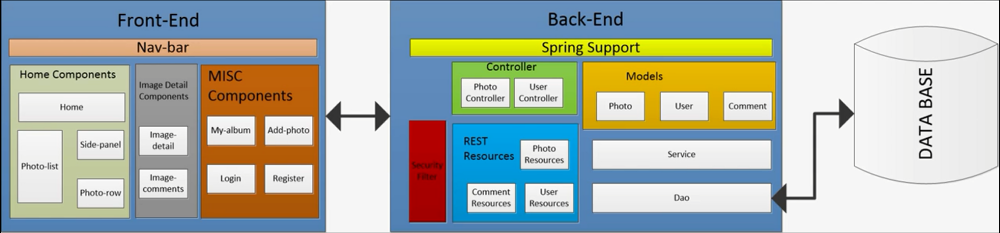


**不能把Angular当作黑盒来使用,要充分了解它的内部结构。**

## 依赖注入

1、 什么是依赖注入？

2、依赖性注入框架

Angular

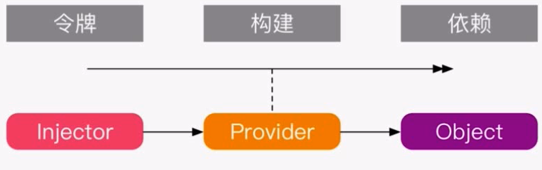

在angular中，我们只要记住依赖注入的三种角色：<font color=red size=4>使用者、服务(依赖对象)及注入器(Injector)</font>


- <font color=#449D44 size=4> @Injectable是@Component的子类</font>

- 每一个HTML标签上面都会有一个注射器实例

- 注射是通过constructor(构造器)进行的

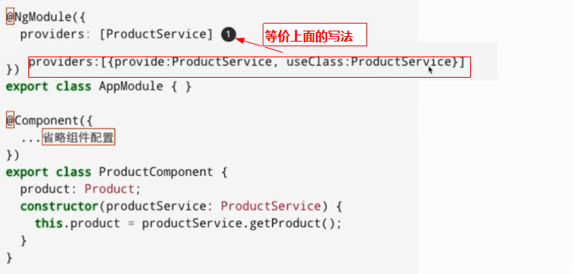

**注入器(Injectable)和提供器(Provider)**

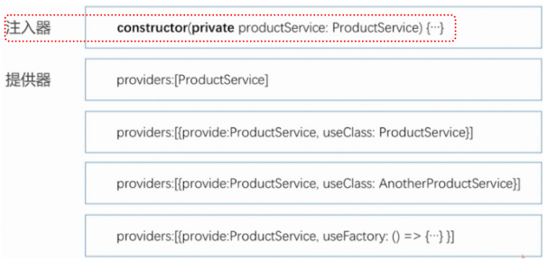


3、依赖性注入进阶

**什么时候使用装饰器：@Injectable( )**

<font color=red size=4>当创建服务（service）需要在构造函数中注入依赖对象，就需要使用 Injectable 装饰器。</font>

延伸1：@Injectable() 是必须的么？

如果所创建的服务不依赖于其他对象，是可以不用使用 `Injectable` 类装饰器。但当该服务需要在构造函数中注入依赖对象，就需要使用 Injectable 装饰器。不过<font color=#449D44 size=4>比较推荐的做法不管是否有依赖对象，在创建服务时都使用 `Injectable 类装饰器`。</font>

延伸2：注入器的层级关系( 服务之间如何之间注入 )

- 提供器可以声明在模块中，也可以声明在组件中。
- 在angular中只有一种注入，那就是构造器注入。如发现无参构造器，这就说明这个组件没有被注入任何东西。


## ChangeDeteccion

检测程序内部状态，然后反映到UI上

引起状态变化(异步)：

- Events
- XHR
- Times

## 指令

组件是一种特殊的指令（组件是一种带模板的指令）

- 结构型指令  --改变元素的布局
- 属性型指令  --改变外观和行为

> 属性型指令

Renderer 2 和 ElementRef

**Angular 不提倡直接操作DOM**

**对于DOM的操作应该通过Renderer 2来进行**

**ElementRef 可以理解成指向DOM元素的引用**

> 结构型指令     

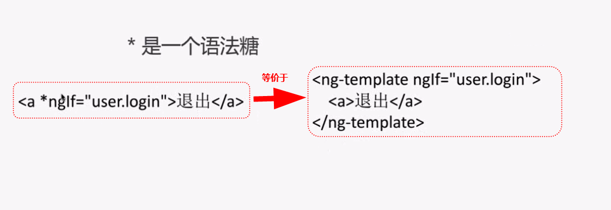

>样式

**ngClass，ngStyle，[class.yourstyle]**

ngClass： 用于条件动态指定样式类，适合对样式做大量更改的情况

ngStyle： 用于条件动态指定样式，适合少量更改的情况

[class.yourcondition]="condition" : 直接对应一个条件

### 延伸1: <font color=red>`<ng-template>`</font>与<font color=red> `<ng-container>`</font> 有什么区别？

<font color=red>`<ng-template>`</font> 用于定义模板，使用<font color=red> `*`</font> 语法糖的结构指令，最终都会转换为 <font color=red>`<ng-template>`</font> 模板指令，模板内的内容如果不进行处理，是不会在页面中显示

<font color=red>`<ng-container>`</font> 是一个逻辑容器，可用于对节点进行分组，但不作为 DOM 树中的节点，它将被渲染为 HTML中的 `comment` 元素，它可用于避免添加额外的元素来使用结构指令。

**小贴士：**

<font color=blue>`ng-container`既不是一个Component，也不是一个Directive，只是单纯的一个特殊tag。 </font>

```小贴士
这点类似于template，Angular复用了HTML5规范中template 的tag的语义，不过并没有真正利用其实现，因此在审查元素中是永远也找不到一个template元素的。 
不过，由于ng-container并不是HTML5中的，为了保持区分度，采用了ng-作为前缀。所以现在我们可以知道，ng-container是Angular所定义的一个特殊tag。
```
### 延伸2：不要混淆 `ng-container` 与 `ng-content`

<font color=red>`ng-content`</font> 是一个占位符，有些类似于`router-outlet`

**拓展1：**  那为什么要是使用`ng-content`？什么场景使用呢？

答：&nbsp;&nbsp; 父组件包含子组件都是直接指明子组件的`selector`，比如子组件的`selector`叫`app-child`，那么嵌入父组件时直接指明即可:<font color=blue>`<app-child></app-child>`</font>

&nbsp;&nbsp; 这是很硬性的编码，而<font color=red>`ng-content`</font>就是用来替代这种硬性编码的。
 
### 延伸3： <font color=red>TemplateRef</font> 与 <font color=red> ViewContainerRef </font> 有什么作用？
+ TemplateRef：用于表示内嵌的 template 模板元素，通过 TemplateRef 实例，我们可以方便创建内嵌视图(Embedded Views)，且可以轻松地访问到通过 ElementRef 封装后的 nativeElement。需要注意的是组件视图中的 template 模板元素，经过渲染后会被替换成 comment 元素。

+ ViewContainerRef：用于表示一个视图容器，可添加一个或多个视图。通过 ViewContainer
Ref 实例，我们可以基于 TemplateRef 实例创建内嵌视图，并能指定内嵌视图的插入位置，也可以方便对视图容器中已有的视图进行管理。简而言之，ViewContainerRef 的主要作用是创建和管理内嵌视图或组件视图。
### 延伸4： ViewChild和ViewChildren

<font color=#87A44D>ViewChild</font> 该装饰器用于获取模板视图中的元素或直接调用其组件中的方法。它支持 Type 类型或 string 类型的选择器，同时支持设置 read 查询条件，以获取不同类型的实例。比如`ElementRef`和`ViewContainerRef`.

<font color=#87A44D>ViewChildren</font> 该装饰器是用来从模板视图中获取匹配的多个元素，返回的结果是一个 QueryList 集合。

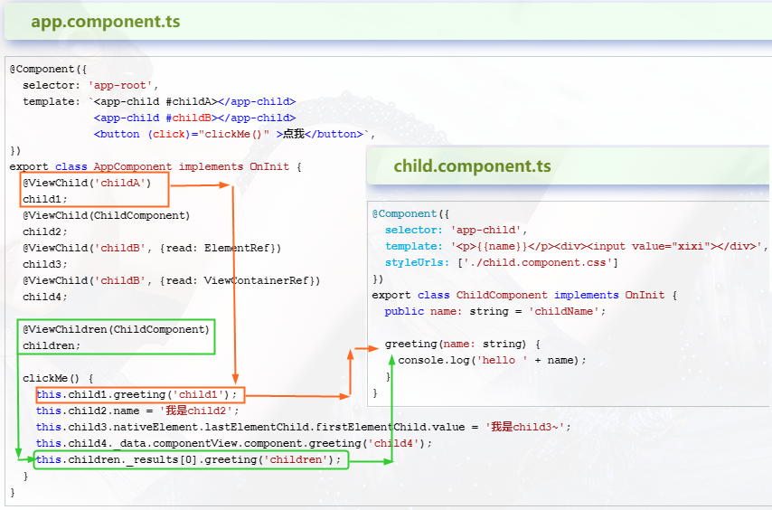

### 通信

+ 父子组件通信
  + 父子组件通信一般使用@Input和@Output即可实现.
  + 通过Subject

+ 非父子组件通信
  + 非父子组件见通信可以通过同一个service来实现。需要注意的是一定要在service中<font color=blue>定义一个临时变量来供传递</font>


## 模块

什么是模块？

**declarations:** 模块内部`Components/Directives/Pipes`的列表，声明一下这个模块内部成员(<font color=#69B6E4 size=4>本模块创建的组件，加入到这个元数据中的组件才会被编译</font>)

**imports：** 导入<font color=red>其他module</font>，其它module暴露的出的Components、Directives、Pipes等可以在本module的组件中被使用。比如导入CommonModule后就可以使用NgIf、NgFor等指令。(<font color=#69B6E4 size=4>引入的外部NG模块</font>)

**exports：** 用来控制将哪些内部成员暴露给外部使用。导入一个module并不意味着会自动导入这个module内部导入的module所暴露出的公共成员。除非导入的这个module把它内部导入的module写到exports中。

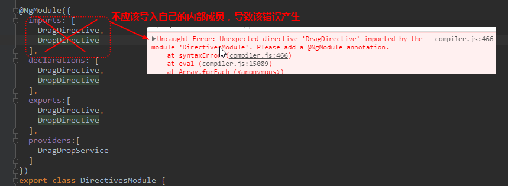

**providers：** 指定应用程序的根级别需要使用的service。（Angular2中没有模块级别的service，所有在NgModule中声明的Provider都是注册在根级别的Dependency Injector中）

**bootstrap：** 通常是app启动的根组件，一般只有一个component。bootstrap中的组件会自动被放入到entryComponents中。(<font color=#69B6E4 size=4>声明启动引导哪个组件，必须是编译过的组件</font>)

&nbsp;&nbsp;&nbsp;&nbsp;需要强调的是，`bootstrap`元数据声明的组件必须是编译过的组件：它要么属于 使用`imports`元数据引入的外部NG模块，要么是已经在`declarations`元数据 中声明的本地组件。

**entryCompoenents:** 不会再模板中被引用到的组件。这个属性一般情况下只有ng自己使用，一般是bootstrap组件或者路由组件，ng会自动把bootstrap、路由组件放入其中。 除非不通过路由动态将component加入到dom中，否则不会用到这个属性。

**模块的元数据？**

@NgModule元数据告诉Angular编译器要为当前模块编译哪些组件，以及如何把当前模块和其它模块链接起来。

**经常看到的`forRoot()`是什么鬼？**

静态方法forRoot是一个约定，它可以让开发人员更轻松的配置模块的提供商。

RouterModule.forRoot就是一个很好的例子。 应用把一个Routes对象传给RouterModule.forRoot，为的就是使用路由配置全应用级的Router服务。 RouterModule.forRoot返回一个ModuleWithProviders对象。 我们把这个结果添加到根模块AppModule的imports列表中。

只能在应用的根模块AppModule中调用并导入.forRoot的结果。 在其它模块中导入它，特别是惰性加载模块中，是违反设计目标的并会导致一个运行时错误。

RouterModule也提供了静态方法forChild，用于配置惰性加载模块的路由。

forRoot和forChild都是方法的约定名称，它们分别用于在根模块和特性模块中配置服务。

Angular并不识别这些名字，但是Angular的开发人员可以。 当你写类似的需要可配置的服务提供商时，请遵循这个约定。

## 模板型驱动表单 和 响应式表单

- 模板型驱动表单 

**特点** 

1、表单的数据绑定(例如ngModel的双向绑定)
2、ngModel的困惑

- 响应式表单

**三个重要元素：**

- FormControl
- FormGroup
- FormBuilder

## 路由

| 名称       | 简介        |
|:------------- |-------------:|
| Routes      | 路由配置，保存着那个URL对应展示哪个组件，以及在哪个RouterOutlet中展示组件 |
| RouterOutlet      | 在Html中标记路由呈现位置的占位符指令     |
| Router | 负责在运行时执行路由的对象，可以通过调用器navigate() 和navigateByUrl()方法来导航到一个指定的路由     |
| RouterLink | 在Html中声明路由导航用的指令     |
| ActivedRoute | 当前激活的路由对象，保存着当前路由的信息，如路由地址，路由参数等     |

<font size=5 color=#6D8B26> Routes </font>  其实是一个Route类的数组。

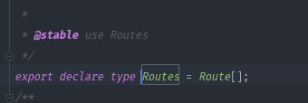

而`Route`的参数如下图所示，一般情况下，`path`和`component`是必选的两个参数。比如：`path:/a`,`component:A`则说明，当地址为`/a`时，应该展示组件`A`的内容。  

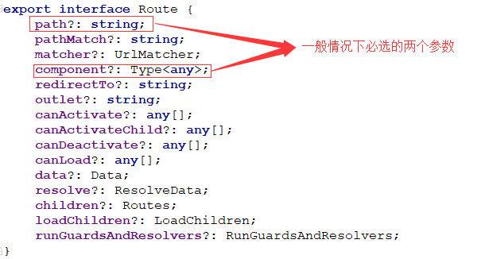

**其余类的简介见下图：**

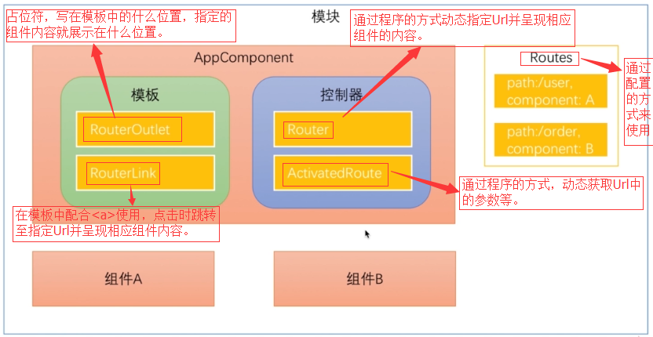

### 延伸1： 路由参数传递 -- 参数传递的几种方式

+ 普通方式传递数据：`/product?id=1&name=iphone => ActivatedRoute.queryParams[id]`;
+ rest方式传递数据：`{path:/product/:id} => /product/1 => ActivatedRoute.params[id];`
+ 路由配置传递数据：`{path:/product,component:ProductComponent,data:[{madeInChina:true}]} => ActivatedRoute.data[0][madeInChina];`


## 数据绑定、响应式编程和管道、@Input()与@Output()

<font color=#11A8EF>数据绑定:</font> Angular中的数据绑定指的是同一组件中<font color=red>控制器文件(.ts)</font>与<font color=red>视图文件(.html)</font>之间的数据传递。

+ <font color=#8F4B1C>单向绑定：</font> 它的意思是要么是ts文件为html文件赋值，要么相反。


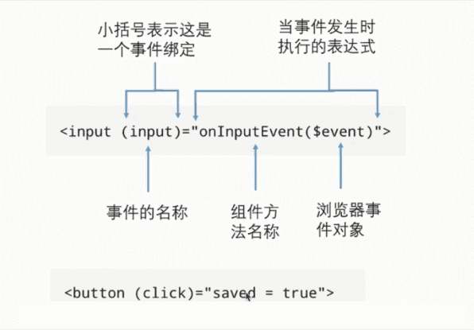

+ <font color=#8F4B1C>双向绑定:</font> ts文件与html文件中绑定的值同时改变。


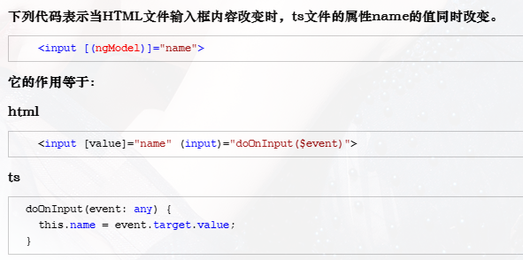
#### DOM属性和HTML属性

+ 1、少量 HTML 属性 和 DOM 属性之间有着1:1的映射，如id。(<font color=red>HTML元素属性和DOM属性的名称和值大部分都相同</font>)

+ 2、有些HTML属性没有对应的DOM属性，如 colspan

+ 3、有些DOM属性没有对应的HTML属性，如textContent。有些名字相同，HTML属性和DOM属性的值也不是同一样东西。

+ 4、HTML属性的值指定了初始值；DOM属性的值标识当前值。<font color=red>DOM属性的值可以改变；HTML属性的值不能改变。</font>

+ 5、模板绑定是通过DOM属性和时间来工作的，而不是 HTML 属性。

### DOM属性绑定

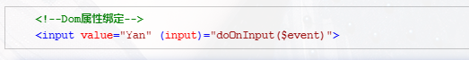

### HTML属性绑定

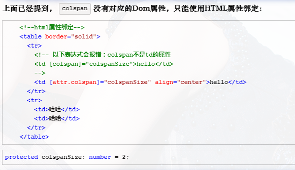

**DOM绑定与HTML属性绑定的区别**

| | DOM绑定 | HTML绑定 |
| :------| ------: | :------: |
|相同情况下|	一个元素的id||
|有html属性无dom属性|	|	表格中td的colspan|
|有dom属性无html属性|textContent属性||
|关于值|	dom表示当前值|	html表示初始化值|
|关于可变|	dom值是可变的|	html值是不可变的|

<font color=#449D44 size=3>总结:我们模板绑定是通过DOM属性来操作的，不是HTML属性来操作的</font>

### 类绑定

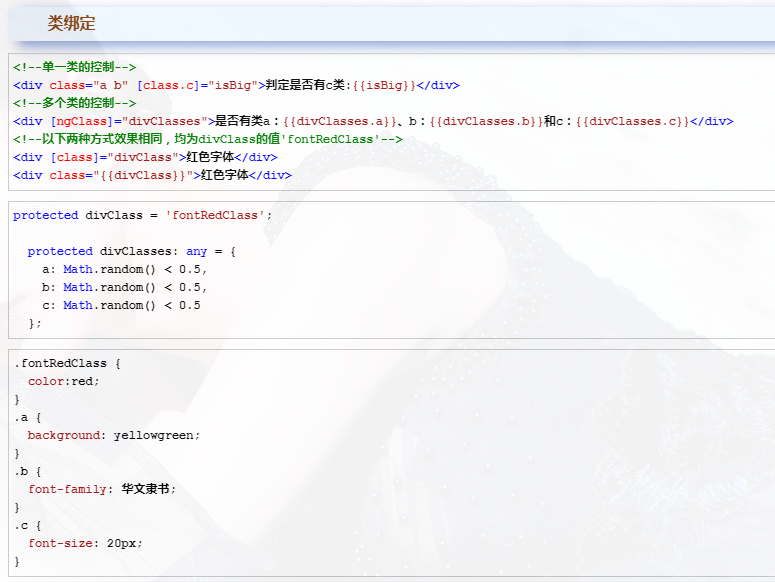

### 样式绑定

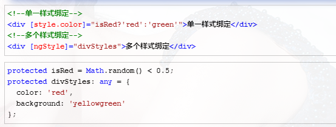

#### 模板变量

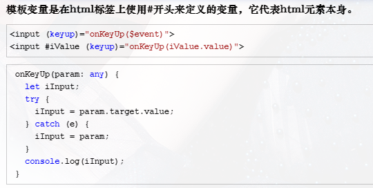

##### Angular中的输入输出是通过注解`@Input`和`@Output`来标识，它位于组件控制器的属性上方。<font color=red>输入输出针对的对象是父子组件</font>。

## RxJS


## Redux 

1、Redux 是什么？

全局的、唯一的、不可变的内存状态[数据库]

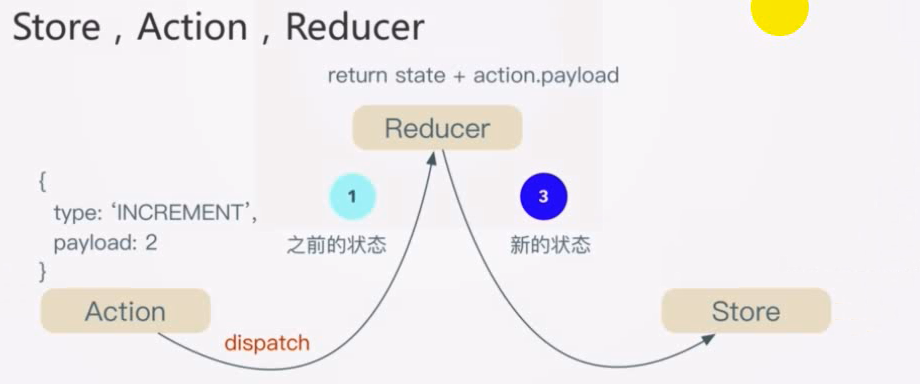

## Angular 整合Redux

#### 导入NgRedux

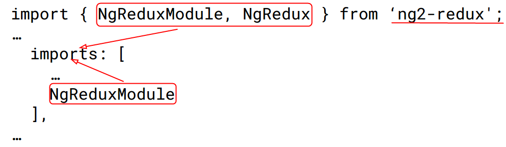

#### 构造参数为`store`的构造器

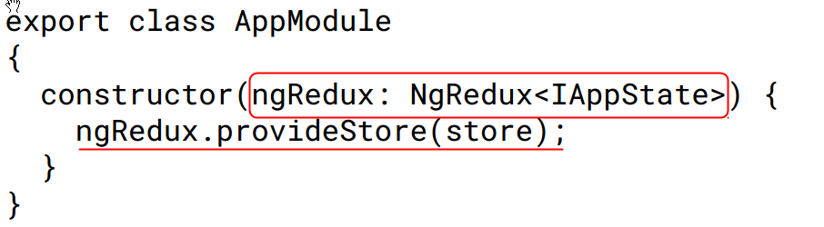

#### 在你的组件(components)中使用`store`
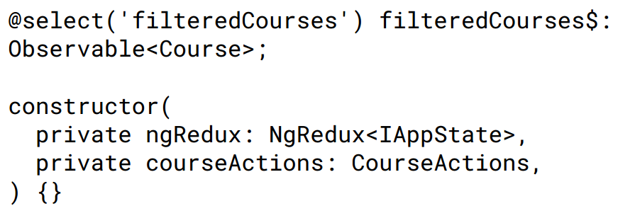

#### 注入Actions

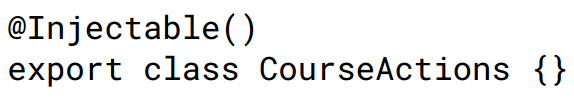

#### Accessing(访问) Services from Actions

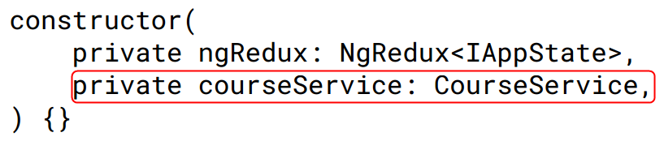

#### Dispatching(调度、派遣) Actions

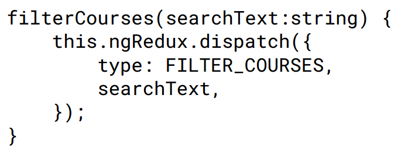

## 目前Angular整合Redux两种方式：

+ `Ng-redux` 核心仍使用 Redux，增加對 Angular 的支援

+ `Ngrx` 只有概念使用 Redux，核心完全使用 RxJS 重新操作。

**安裝 Ngrx** 
```
npm install @ngrx/core @ngrx/store --save
```

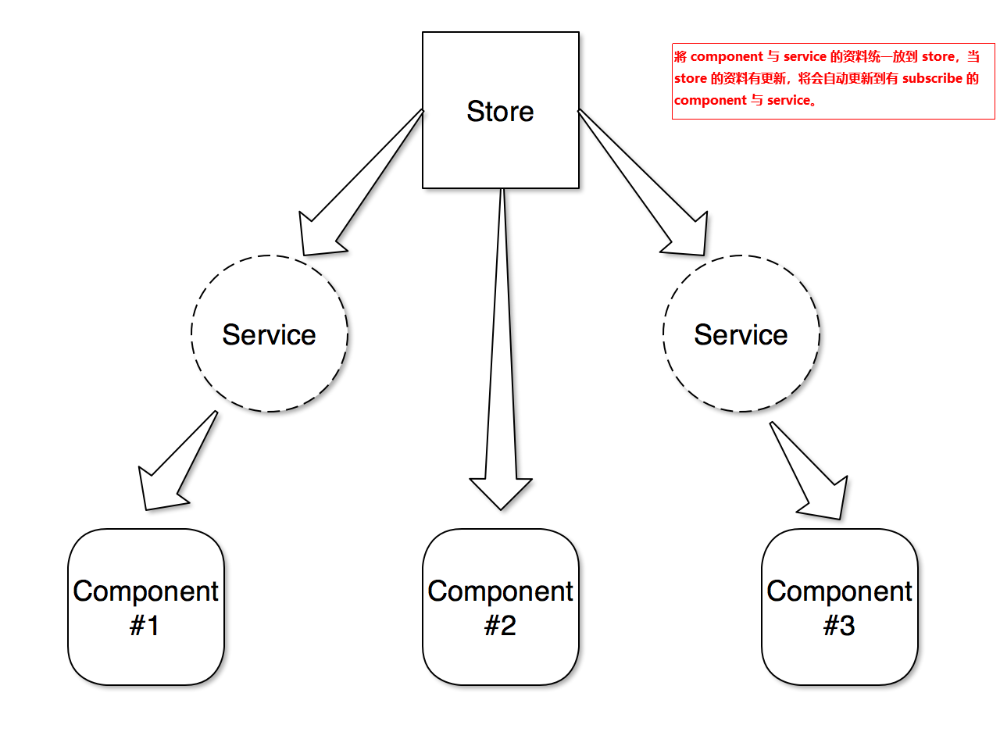

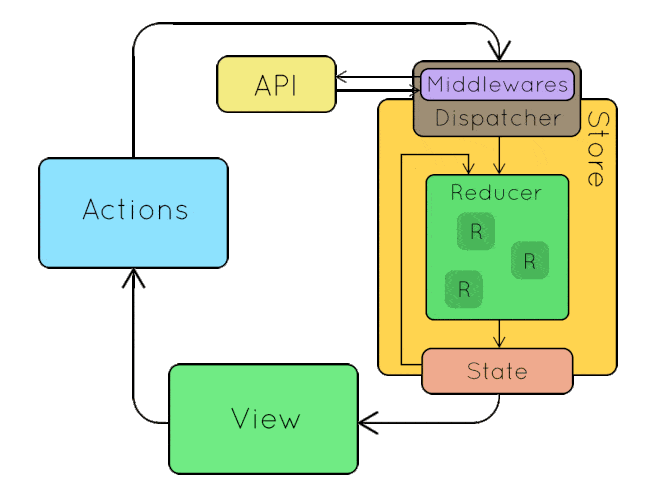

**View** 相当于`component`，主要在显示使用者界面。

**Action** 当`component` 有任何 `event` 時，会对 `Ngrx` 发出 `action`。

**Middleware** 负责存取对 `server` 端的 API

**Dispatcher** 负责接受 `component` 传来的 action，并将 `action` 传给 `reducer`。

**Store** 可是为 `Ngrx` 在浏览器端的资料库，各 `component` 的资料都可统一放在这里。

**Reducer** 根据`dispatcher` 传来的 `action`，决定该如何写入state。

  当 `state` 有改变时，將通知有`subscribe`该`state`的`component`自动更新。

**State** 存放在 `store` 內的资料。

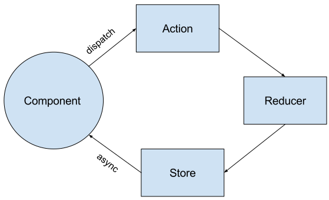

有些东西Ngrx 已经帮我们做了，真的要我們自己操作只有 4 個部份，且资料流为单向的 : `Component -> Action -> Reducer -> Store -> Component`。

### 什么时候该使用Ngrx？

+ 当多个 `component` 需使用共用资料，且各 `component` 的操作会影像其他 `component` 的结果。
+ 资料可能同时被多个`component`修改，甚至同時被 `server API `修改。
+ 需要操作undo/redo 功能。

> 案例--操作：

[新版迁移指南 ：https://github.com/ngrx/platform/blob/master/MIGRATION.md](https://github.com/ngrx/platform/blob/master/MIGRATION.md)

**AppModule：app.module.ts**

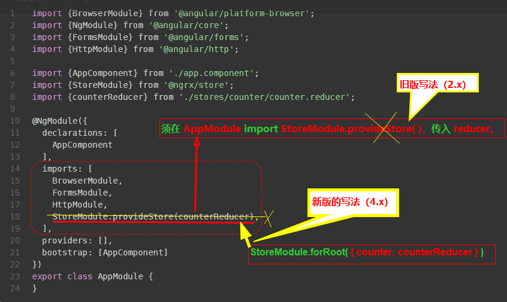

**AppComponent ：--> app.component.html、app.component.ts**

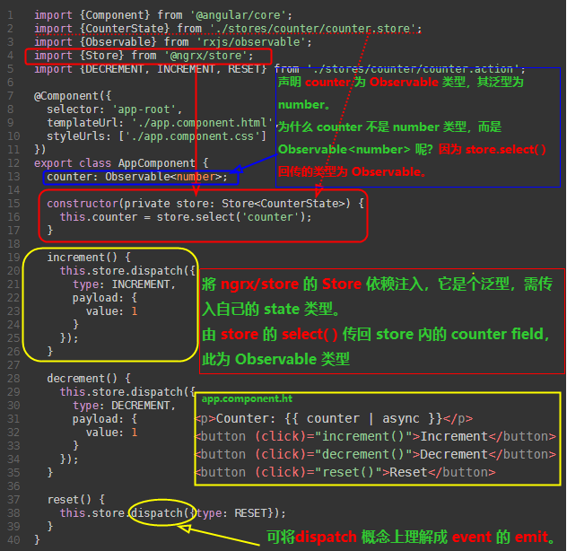

**Action ：--> counter.action.ts**

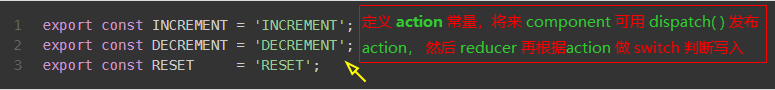

**Reducer ：--> counter.reducer.ts**

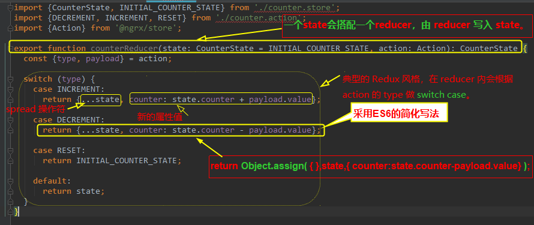

**Store ：--> counter.store.ts**

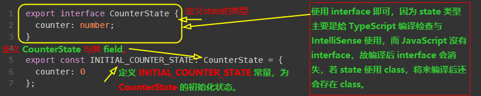

### Redux 在您的Angular应用使用`reselect`进行状态函数的高阶运算

reselect：带‘记忆’功能的函数运算

无论多少参数，最后一个才是用于函数计算，其他的都是他的输入

```typescript
export const getTasksWithOwner = createSelector(getTasks,getUserEntities,(tasks,entities) ={
   return tasks.map(task =>{
    const owner = entites[task.ownerId];
    const participants =task.participantIds.map(id => entites[id]);
    return Object.assgin({ },task,{owner:owner},{participants:[...participants]});
   });
})
```

## 使用`@ngrx/store`

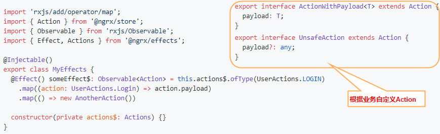

**Registering Reducers**

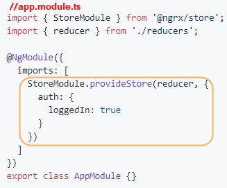

简化：
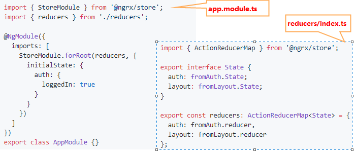

示例：
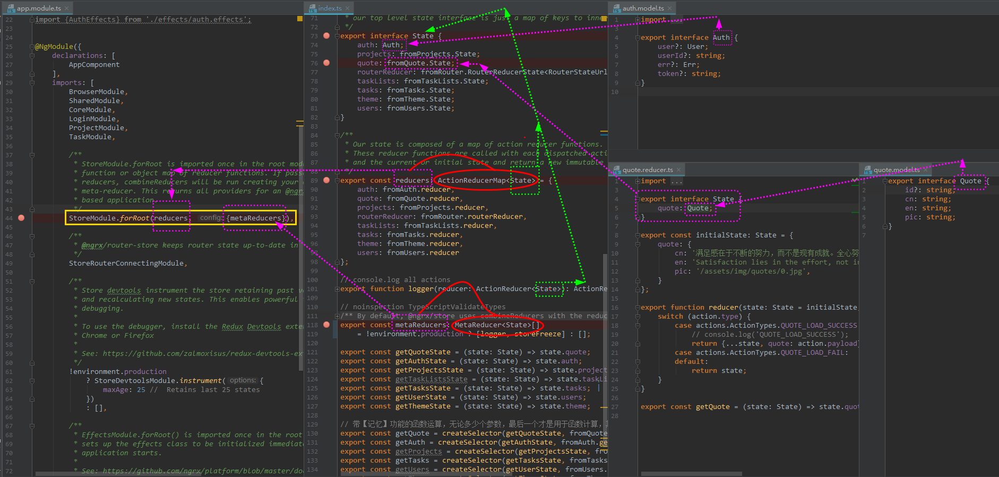


## 什么是Effect?

<font color=red size=4>@Effect( ) 标识是一个Observable<Action>流。</font>

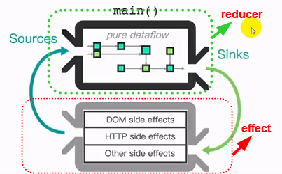
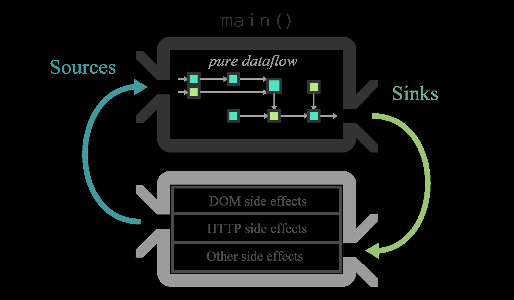


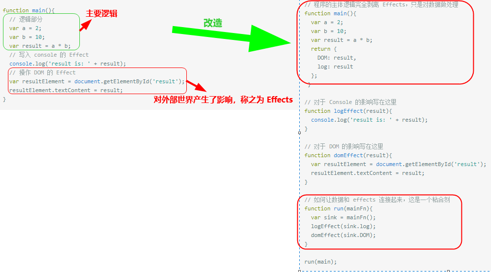

**使用effect：`import {Actions, Effect} from '@ngrx/effects';`**

```typescript
@Injectable()
export class AuthEffects{
  // 通过构造注入需要的服务和 action 信号流
  constructor(private actions$: Actions, private authService: AuthService) { }
  
  //用 @Effect() 修饰器来标明这是一个 Effect
  @Effect() 
  login$: Observable<Action> = this.actions$ // action 信号流
    .ofType(authActions.ActionTypes.LOGIN) // 如果是 LOGIN Action
    .map(toPayload) // 转换成 action 的 payload 数据流
    .switchMap((val:{username:string, password: string}) => {
      // 调用服务
      return this.authService
          .login(val.username, val.password)
          // 如果成功发出 LOGIN_SUCCESS Action 交给其它 Effect 或者 Reducer 去处理
          .map(user => new authActions.LoginSuccessAction({user: user}))
          // 如果失败发出 LOGIN_FAIL Action 交给其它 Effect 或者 Reducer 去处理
          .catch(err => of(new actions.LoginFailAction(err)));
    });

}
```


顺序安装依赖库
```typescript
$ npm i --save @ngrx/core
$ npm i --save @ngrx/store
$ npm i --save @ngrx/effects

/**
 * 我们使用reselect来实现高效的`state`存取操作。我们将使用`reselect`的
 * `createSelector`方法来创建高效的选择器，这个选择器能被存储且仅在参
 * 数更改的时候才会重构
 */
$ npm i --save reselect
 
 /**
  * 为了让开发更加方便并易于调试，我们添加能够在控制台记
  * 录action和state的更新的store-logger来帮助我们
  */
$ npm i --save ngrx-store-logger 
```

示例：


## 使用`@ngrx/router-store`

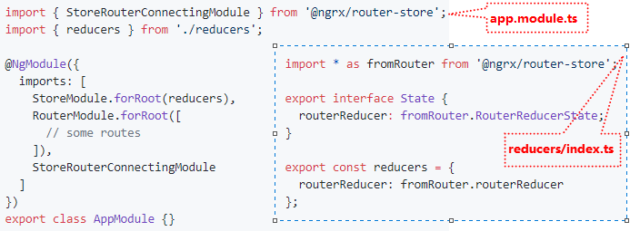


### <font color=#449D44 size =4>Navigation actions</font>

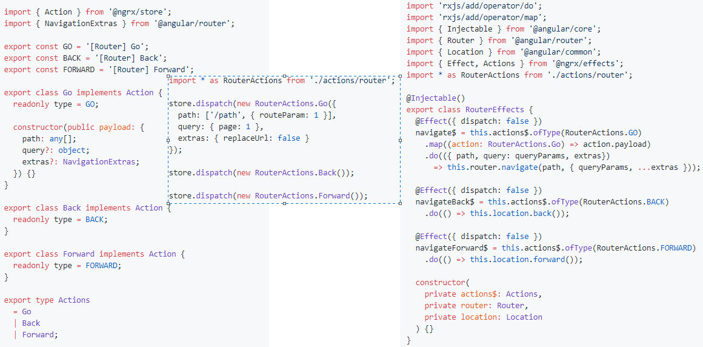

示例：


## 使用`@ngrx/store-devtools`
注册到模块中
```typescript
import { StoreDevtoolsModule } from '@ngrx/store-devtools';
import { environment } from '../environments/environment'; // Angular CLI environment

@NgModule({
  imports: [
    !environment.production ? StoreDevtoolsModule.instrument({ maxAge: 50 }) : []
  ]
})
export class AppModule {}
```


## 常出现的异常解决方案


1、多次声明同一个组件

组件是 Angular 应用程序中的常见构建块。每个组件都需要在<font color=rde> `@NgModule.declarations`</font> 数组中声明，才能够使用。在 Angular 中是不允许在多个模块中声明同一个组件，如果一个组件在多个模块中声明的话，那么 Angular 编译器将会抛出异常。

> 场景使用 -- 在多个模块中使用同一个组件是允许的

+ 如果一个模块作为另一个模块的子模块，那么针对上面的场景解决方案将是：
  + 在子模块的 <font color=red> @NgModule.declaration </font> 中声 <font color=red>HeroComponent</font> 组件
  + 通过子模块的<font color=red> @NgModule.exports </font>数组中导出该组件
  + 在父模块的 <font color=red> @NgModule.imports </font>数组中导入子模块

+ 对于其它情况，我们可以创建一个新的模块(共享模块)，如<font color=red> SharedModule</font> 模块。具体步骤如下：
   + 在 <font color=red>SharedModule</font> 中声明和导出 <font color=red>HeroComponent</font>
   + 在需要使用 <font color=red>HeroComponent</font> 的模块中导入<font color=red> SharedModule</font>

2、<font color=#AE0000 size=3>angular: Error: Uncaught (in promise): Error: StaticInjectorError...</font>

原因：构建的service没有添加到module里造成的 或者 service module没有在app 的module下引入。

3、<font color=red size=3>core.js:1350 ERROR Error: Uncaught (in promise): Error: StaticInjectorError[Http]: StaticInjectorError[Http]: NullInjectorError: No provider for Http!</font>

将HttpMoudle导入到我的app.module.ts中，问题就没有了

```
import { HttpModule } from '@angular/http';
```